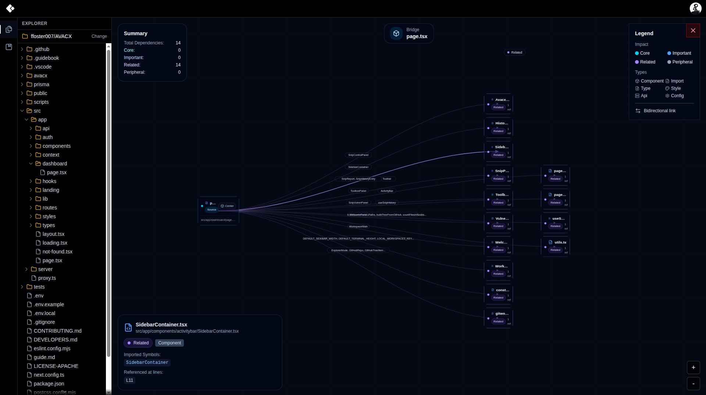

<p align="center">
  <a href="#" target="_blank" rel="noopener">
    
  </a>
</p>

## Bookmark tool, repository analysis and management.

<p align="center">
  <a href="#" target="_blank" rel="noopener">
    
  </a>
</p>

## Analyze and trace 

Analyze and trace file paths within a project repository, making it easier to understand structure as the project grows.

<p align="center">
  <a href="#" target="_blank" rel="noopener">
    
  </a>
</p>

## Getting Started
First, run the development server:

```
npm install

npm run dev

Open in http://localhost:3000 
```

## Backend
The backend for Calitor is built using Rust and can be found at:
```
https://github.com/ffoster007/celitor_blackend_rust
```

# Calitor