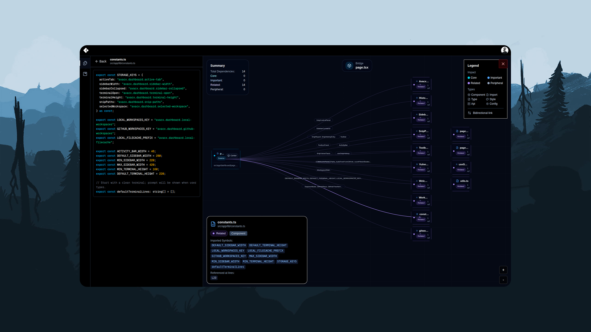

<p align="center">
  <a href="#" target="_blank" rel="noopener">
    
  </a>
</p>

## Bookmark tool, repository analysis and management.

<p align="center">
  <a href="#" target="_blank" rel="noopener">
    
  </a>
</p>

## Getting Started
First, run the development server:

```
npm install
```

```bash
npm run dev
```

## Backend
The backend for Calitor is built using Rust and can be found at:
```
https://github.com/ffoster007/celitor_blackend_rust
```


Open [http://localhost:3000](http://localhost:3000) with your browser to see the result.

You can start editing the page by modifying `app/page.tsx`. The page auto-updates as you edit the file.
# Calitor